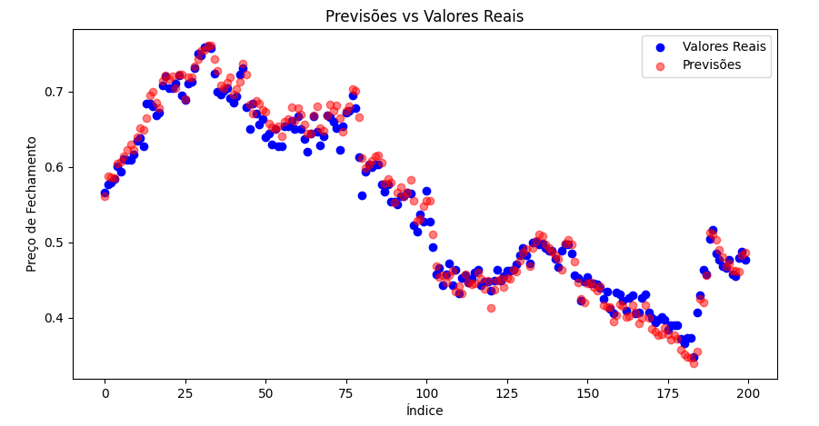
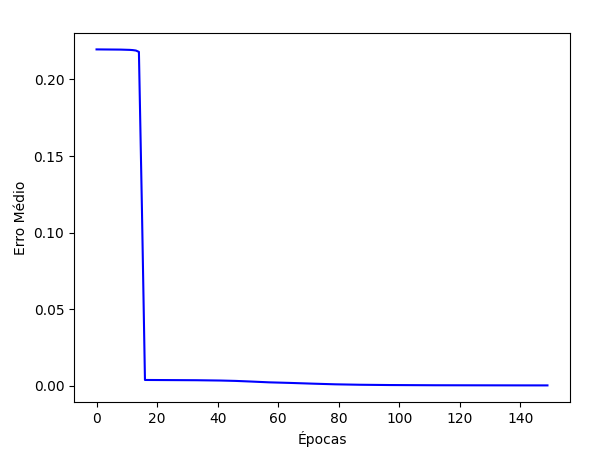

# Previsão do preço de ações

### Introdução
Este relatório apresenta uma análise detalhada do dataset utilizado em um projeto de previsão de preços de ações utilizando redes neurais. O objetivo é descrever o dataset, explicar a escolha dos atributos para o treinamento da rede neural e discutir as variações e análises realizadas.

### Descrição do Dataset
O dataset utilizado é composto por dados do mercado de ações, especificamente da empresa 'ALLIAR', no setor de 'Saúde', sub-setor de 'Análises e Diagnósticos'. Os dados foram coletados em 2018 e incluem informações como preço de abertura, preço máximo, preço mínimo, preço de fechamento, volume, preço ajustado, data de referência, ticker, retorno dos preços ajustados, retorno dos preços de fechamento, entre outros. 

Os atributos selecionados para o treinamento da rede neural foram 'price.open', 'price.high', 'price.low', e 'volume'. Eles foram escolhidos por serem indicadores significativos do comportamento do mercado de ações, refletindo as variações diárias e o interesse dos investidores. O atributo alvo é 'price.close', que representa o preço de fechamento das ações, um indicador crucial para previsões de mercado.

**Fonte:** https://www.kaggle.com/datasets/lucasprado/acoesbrasileiras2018a2021

### Metodologia
A metodologia empregada no projeto envolve a normalização dos dados de entrada, a divisão em conjuntos de treino e teste, e a utilização de uma rede neural com três camadas escondidas para a previsão dos preços de fechamento das ações.

### Análise das Variações e Resultados
As variações obtidas durante o treinamento e teste da rede neural foram analisadas através de gráficos comparativos entre as previsões e os valores reais, além da análise dos erros de previsão. Os resultados indicam a eficácia da rede neural em capturar tendências do mercado, embora com algumas limitações evidenciadas pelos erros de previsão.

### Conclusão
Em conclusão, o projeto fornece uma base sólida para o desenvolvimento de ferramentas preditivas no mercado de ações e reforça a importância da ciência de dados e do aprendizado de máquina no domínio financeiro.